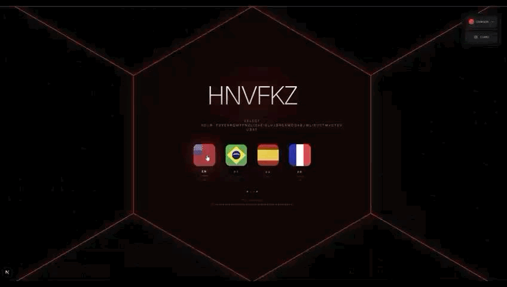
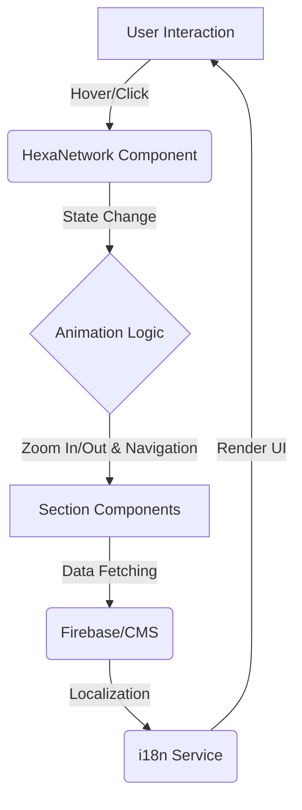

# HexaGrid Portfolio: A Dynamic & Interactive Product Engineering Showcase

> "Is the PDF resume dead? Probably not, but I engineered a SaaS platform just in case."

Welcome to the HexaGrid Portfolio, a testament to modern product engineering, interactive design, and robust system architecture. This repository hosts a dynamic and visually engaging online portfolio, meticulously crafted to showcase my expertise and innovative approach to software development. It's more than just a collection of projects; it's an interactive experience built with a focus on performance, scalability, and maintainability.

## 🚀 Technology Stack

This project is built upon a modern, robust, and scalable technology stack, carefully selected to deliver a high-performance and maintainable application.


## ✨ Visual Proof



_Witness a few seconds of the HexaGrid Portfolio in action. This visual proof offers a concise yet comprehensive tour, highlighting the fluid user experience, responsive design, and core interactive features that define this project. It's designed to give you an immediate understanding of the application's capabilities and aesthetic._


## 📐 Architecture Diagram



\_This Mermaid.js diagram provides a high-level overview of the application's architecture, specifically detailing the interaction flow for the HexaGrid navigation system. It visually demonstrates the separation of concerns, data flow from user interaction through animation logic and data fetching, highlighting a well-planned and modular system design.

## 🤖 AI Integration: Automated Localization

One of the standout features of the CMS is the **AI-Powered Translation Engine**.

Instead of manually translating every content update into 4 languages, I engineered a reusable Server Action utilizing the **Google Gemini API**.

- **How it works:** The component accepts a generic content schema (JSON), sends it to Gemini with a strict system prompt to preserve tone and context, and returns the structured JSON translated into English, Spanish, and French almost instantly. (free tier)
- **The Impact:** drastically reduced content management time, allowing for real-time updates across all international locales easily.

## 💡 Strategic Trade-offs: Engineering Decisions with Business Impact

- **Pragmatic Approach to Internal Tools (The Admin Panel)**: Initially, this repository was intended to be private. As a result, the Administrative Panel (`/admin`) was built with a "Velocity First" mindset. Unlike the public-facing application—which is highly modular and fully internationalized—the Admin dashboard is hardcoded in **Portuguese (PT-BR)** and less strictly componentized.

  - **The Rationale:** As the sole user of the CMS, investing time in translating or over-engineering the admin interface would yield zero ROI. This reflects a Product Engineering mindset: **perfect the user experience, but be pragmatic with internal operations.**

* **Pragmatic Approach to Internal Tools (The Admin Panel)**: Initially, this repository was intended to be private. As a result, the Administrative Panel (`/admin`) was built with a "Velocity First" mindset. Unlike the public-facing application—which is highly modular and fully internationalized—the Admin dashboard is hardcoded in **Portuguese (PT-BR)** and less strictly componentized.

  - **The Rationale:** As the sole user of the CMS, investing time in translating or over-engineering the admin interface would yield zero ROI. This reflects a Product Engineering mindset: **perfect the user experience, but be pragmatic with internal operations.**

This section highlights critical architectural and technical decisions, demonstrating a pragmatic and well-reasoned approach to software engineering that balances technical purity with real-world constraints and objectives. Each trade-off reflects a deep understanding of system design, performance optimization, and resource management.

- **Firebase (NoSQL) for Speed & Cost-Efficiency**: Instead of traditional SQL databases that often suffer from "cold start" latencies on free tiers, Firebase's NoSQL solution was chosen to ensure near-instantaneous data retrieval. This decision was driven by a strategic focus on delivering an exceptionally fast user experience (UX) and optimizing cloud infrastructure costs, acknowledging that for a portfolio's specific data model, the benefits of relational integrity were outweighed by the need for immediate responsiveness and economic efficiency. This showcases a keen awareness of cloud architecture, performance engineering, and cost-benefit analysis.

- **Contextual O(N²) Complexity for Hexagonal Grid Rendering**: While the rendering of the hexagonal network, particularly the connections between nodes, theoretically presents an O(N²) complexity, this was a deliberate and optimized choice. For the intended visual scale of this portfolio (typically fewer than 50 interactive nodes), the performance impact is negligible. This decision demonstrates an understanding that theoretical complexity must be evaluated within practical constraints and expected usage patterns, prioritizing rich visual interaction without compromising perceived performance, rather than over-engineering for hypothetical extreme scales.

* **Proactive WebP Optimization on Frontend for Enhanced UX**: To guarantee superior loading times and reduced bandwidth consumption, images are dynamically converted and optimized to WebP format directly on the frontend. This proactive performance engineering measure significantly enhances the overall user experience, contributes positively to SEO rankings by improving Core Web Vitals, and ensures the portfolio remains fast and accessible across various network conditions.

## 🧩 User Controls

The platform offers a dedicated SiteControls component that allows users to fully personalize their browsing experience.
Through this panel, users can adjust several preferences in real time, including:

**🕹️ Animation Control**

Enable or disable transition animations to match your preferred browsing speed and comfort level.

**🎨 Theme Mode**

Switch between Light and Dark mode for optimal visibility and personal style.

**🌐 Language Selection**

Choose the interface language for a more accessible and localized experience.

**🌈 Accent Color**

Customize the platform’s highlight color to match your personal aesthetic.

## ⚙️ Custom Headless CMS: Elevating Content Management

Beyond the frontend, a powerful and highly customized administrative panel was developed from the ground up, serving as a bespoke Headless CMS. This solution leverages the full power of TypeScript Generics, enabling the creation of a type-safe, flexible, and highly extensible content management system. This approach offers several key advantages over off-the-shelf CMS solutions:

- **Tailored Content Structure**: Complete control over the data model, perfectly aligned with the portfolio's unique content requirements without unnecessary overhead.
- **Enhanced Performance**: Optimized data fetching and management specifically for the application's needs, avoiding the bloat often associated with generic CMS platforms.
- **Advanced Type Safety**: Utilizing TypeScript Generics significantly reduces runtime errors and improves developer experience, ensuring data consistency and integrity across the application.
- **Demonstration of Advanced Engineering**: Building a custom CMS showcases not just proficiency in frontend frameworks, but also a deep understanding of full-stack architecture, data modeling, and robust software design principles.

## 🔒 Robust Security with Firestore Rules

Security is paramount, especially for publicly accessible applications. This project implements stringent Firestore Security Rules to safeguard data integrity and prevent unauthorized modifications to the database. The embedded rules below demonstrate a foundational security posture:

```firestore
rules_version = '2';
service cloud.firestore {
  match /databases/{database}/documents {
    match /{document=**} {
      allow read; // All users can read the public portfolio content.
      allow write: if request.auth != null; // Write access is strictly limited to authenticated administrators.
    }
  }
}
```

_These rules are meticulously crafted to allow public read access for the portfolio's content, ensuring broad visibility. Crucially, write operations are restricted exclusively to authenticated users, typically administrators. This prevents malicious data injection or accidental corruption, underscoring a commitment to secure application development practices and protecting the integrity of the displayed information._

## 🚀 Getting Started: Setting Up Your Local Environment

To get a local copy of the HexaGrid Portfolio up and running, follow these detailed instructions. This will allow you to explore the codebase, contribute to its development, or customize it for your own use.

### Prerequisites

Ensure you have the following software installed on your system:

- **Node.js**: [LTS Version recommended](https://nodejs.org/en/download/) (includes npm)
- **Git**: [Download & Install Git](https://git-scm.com/downloads)

### Installation Steps

1.  **Clone the repository:**
    Begin by cloning the project to your local machine using Git:
    ```bash
    git clone https://github.com/jessicaan/portfolio_2025.git
    cd your-portfolio
    ```
2.  **Install project dependencies:**
    Navigate into the project directory and install all required Node.js packages:
    ```bash
    npm install
    ```
3.  **Configure environment variables:**
    Create a `.env.local` file in the root of your project. This file will store sensitive configuration details, such as Firebase credentials. Refer to the provided `.env.example` file for a list of necessary variables. Your `.env.local` should look similar to this:

    ```
    # Example .env.local content - Replace with your actual Firebase project configuration

    NEXT_PUBLIC_FIREBASE_API_KEY=your_api_key_here
    NEXT_PUBLIC_FIREBASE_AUTH_DOMAIN=your_auth_domain_here
    NEXT_PUBLIC_FIREBASE_PROJECT_ID=your_project_id_here
    NEXT_PUBLIC_FIREBASE_STORAGE_BUCKET=your_storage_bucket_here
    NEXT_PUBLIC_FIREBASE_MESSAGING_SENDER_ID=your_messaging_sender_id_here
    NEXT_PUBLIC_FIREBASE_APP_ID=your_app_id_here

    ```

4.  **Run the development server:**
    Start the Next.js development server:
    ```bash
    npm run dev
    ```
    The application will be accessible in your web browser at [http://localhost:3000](http://localhost:3000).

## 📞 Connect & Explore Opportunities

I am actively seeking challenging **Product Engineering roles** where I can leverage my expertise to build innovative solutions and drive product success. Let's connect and discuss how my skills can contribute to your team.
I am actively seeking challenging **Product Engineering roles** where I can leverage my expertise to build innovative solutions and drive product success. Let's connect and discuss how my skills can contribute to your team.

- **LinkedIn**: [Your LinkedIn Profile URL]
- **Email**: [Your Email Address]
- **Live Demo**: [Link to your Live Demo] (Experience the HexaGrid Portfolio live!)

Feel free to reach out with any questions, collaboration proposals, or career opportunities.
